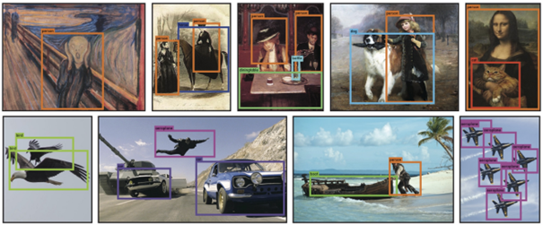

<!--truncate-->

## Data Science 

### Distributed computing: how to leverage Fugue to scale your code?     

As python users and data lovers, we are using pandas in our daily life. However, pandas has inner limitations when working with large datasets. Alternatives for distributed computing exist but each of them requires us to skill up. The main barrier is the syntax required by the language which is often complex. Different packages tried to simplify the process (koalas for instance) but we want to focus ourselves on Fugue. Fugue is described as a “unified interface for distributed computing that lets users execute Python, pandas, and SQL code on Spark and Dask without rewrites”. Fugue does not require a lot of time to get used to it and is a good common tool for SQL users and python ones. We invite you to watch the video here under which contextualizes Fugue and provides some useful background. 

[Why Pandas-like Interfaces are Sub-optimal for Distributed Computing | by Kevin Kho | Jun, 2022 | Towards Data Science](https://towardsdatascience.com/why-pandas-like-interfaces-are-sub-optimal-for-distributed-computing-322dacbce43)

[Talk - Kevin Kho/Han Wang: Comparing the Different Ways to Scale Python and Pandas Code - YouTube](https://www.youtube.com/watch?v=b3ae0m_XTys)

## Machine Learning

### In-hand NLP search tool backed by Transformers and Q&A: Haystack

Deepset, a German NLP start-up, released a bit more than a year ago a powerful and simple tool: Haystack. Haystack is a comprehensive framework enabling its users to use state-of-the-art Question Answering model to browse large textual datasets. Haystack is a local and little search engine. It is meant to be used by a broad range of users (from beginners to expert). You can tailor some part of the interface and even modify back-end specificities such as the backbone model used (Bert, Roberta, Luke…). 

[GitHub - deepset-ai/haystack](https://github.com/deepset-ai/haystack)

### Liquid Neural Network: Next generation model for sequential data 

Recurrent Neural Network (RNN) demonstrated a strong performance when used for sequential data. RNN are made of complex recurrent units enabling the network to keep track of past information while new inputs are fed in. In 2018, Neural Ordinary Differential Equations appeared and were seen as a major change in how we are modelling data. Instead of modeling the true generative function of Y, we are looking to model its derivative. This article was seen as a major change in how we can shift from a discrete model state to a continuous one. 
Liquid Time Constant Networks (LTC) were introduced in 2020 with a strong emphasis on the concept of hidden state in the model. In previous models, hidden state at time t is optimized according to the output at time t (maximizing the accuracy). In LTCs, hidden state is used both to predict the output, but also the next hidden state t+1. It means that at each time-step, you update your memory, according to what you saw, see and expect to see in the future. This application is particularly powerful when you need to generate data at a given horizon. If you want a quick deep dive in LTC you can follow the first link. The second one is the original paper that might be hard to read the in first instance.

[Liquid Neural Networks in Computer Vision | by Jacob Solawetz | Towards Data Science](https://towardsdatascience.com/liquid-neural-networks-in-computer-vision-4a0f718b464e)

[Article - Liquid Time-constant Networks](https://arxiv.org/pdf/2006.04439.pdf)

## Data Engineering & Architecture

### MongoDB vs ElasticSearch vs Redshift 

Different tools exist when required to structure and organize a data architecture. This blog post presents three contenders to be THE tool to use. The author compares three technologies widely used: MongoDB, ElasticSearch and Amazon Redshift. This comparison will look at how they index, shard and aggregate data. While MongoDB has the biggest popularity and ElasticSearch gains some hype, Amazon Redshift is a tool to be considered.

[Storage for Data Engineering: Which is the Best? | Toptal](https://www.toptal.com/data-science/data-engineering-guide-to-storages)

## App and Web Development

### Using properly Map in Javascript

A “map” object is a new addition coming into Javascript since ES6. While the “object” is widely used for recording values, they should be avoided when you have a variable number entries (that can evolve along time). In this case, using a “map” object is appropriate and results in a significant memory saving and computational performance improvement. 

[When You Should Prefer Map Over Object In JavaScript (zhenghao.io)](https://www.zhenghao.io/posts/object-vs-map)

## Special Section: Yolo’s creator history  

### Jon Redmon, the poney lovers and Computer Vision boss !

For anyone who worked on Computer Vision during studies or even in professional environments, Object Detection always raises as a major challenge. The task consists in detecting in a picture multiple instances and drawing a bounding box around it. Back in 2015, the state-of-the-art architecture is a Region-based Convolutional Neural Network or RCNN (followed by different improvement called Fast-RCNN, Faster-RCNN…). To make it brief and simple, RCNN takes Regions Of Interest (ROIs), which are little rectangle cropped from the image, fed to a Neural Network. Eventually ROIs are pooled together to produce the true bounding boxes we want. The biggest limit of R-CNN is the ROIs generation part which can take a lot of time before getting a prediction (therefore improvements of R-CNN always have a speed related word).

Jon Redmon, who at the time was in the early years of his PhD, proposed a new architecture called YOLO (You Only Look Once). The framework approaches the task of object detection as a regression problem rather than a classification one (R-CNN uses a classifier to predict bounding boxes). He also modifies the framework to get a single network that can be trained and optimized. This change of loss enables the network to be fully trainable on the whole image. The model shows exceptional performance both for real-time detection, but also in terms of accuracy. 

Following this breakthrough, Jon Redmon worked on several new versions of YOLO, all becoming state-of-the-art in the field. However, in early 2020, he decided to stop his research in the field of Computer Vision as he saw a rise of ethical concerns around his work (especially in the military field). 

I strongly invite you to read (at least) his resume which is by far the best one in the AI field! Check out his website to deepen your knowledge about his research. If you want, you can also check his first Yolo paper which is amazing!

[Redmon Resume (pjreddie.com)](https://pjreddie.com/static/Redmon%20Resume.pdf)

[Survival Strategies for the Robot Rebellion (pjreddie.com)](https://pjreddie.com/)

[You Only Look Once: Unified, Real-Time Object Detection](https://arxiv.org/pdf/1506.02640.pdf)

## Credits
- Cover Photo by <a href="https://unsplash.com/@cristofer?utm_source=unsplash&utm_medium=referral&utm_content=creditCopyText">Cristofer Maximilian</a> on <a href="https://unsplash.com/@cristofer?utm_source=unsplash&utm_medium=referral&utm_content=creditCopyText">Unsplash</a>
  