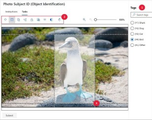
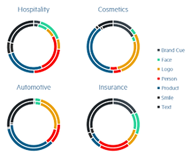
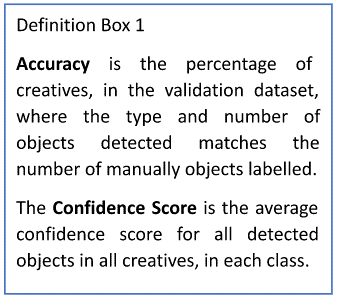
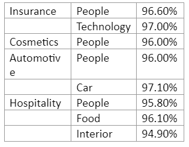
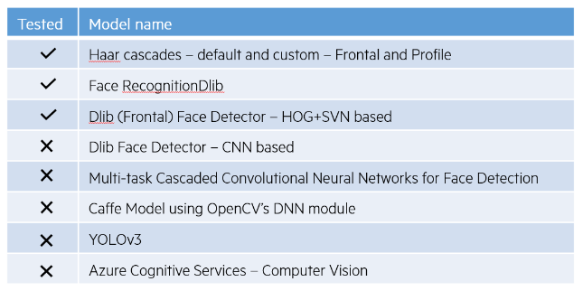
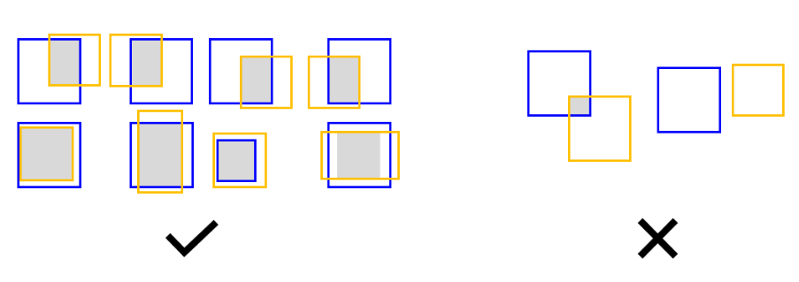

<Head>
<meta property="og:image" content="./img/blog/Eki_meta_part_I.png" />
</Head>


<div align="justify"> 

This article is **Part I** of a set of five technical articles that accompany a [whitepaper](https://ekimetrics.com/news-and-events/exploring-the-links-between-creative-execution-and-marketing-effectiveness-exclusivepreview) written in collaboration between Meta and Ekimetrics. Object Detection (OD) and Optical Character Recognition (OCR) were used to detect specific features in creative images, such as faces, smiles, text, brand logos, etc. Then, in combination with impressions data, marketing mix models were used to investigate what objects, or combinations of objects in creative images in marketing campaigns, drive higher ROIs.
In this Part I we explore the methodology for using pre-trained Detectron2 models to detect brand-specific object in creative images.

 </div>


<!-- import useBaseUrl from "@docusaurus/useBaseUrl";

<link rel="stylesheet" href="{useBaseUrl('katex/katex.min.css')}" />
 -->
<!--truncate-->


## Why you should read this
<div align="justify"> 
This article is primarily directed to machine learning practitioners. Here you will find a practical application of object detection algorithms. We present different open-source resources, comparisons and trade-offs in model selection for specific objects, and methodology to improve performance for custom data sets.
 </div>


## Manual labeling of the Training and Validation data sets

<div align="justify"> 
In order to train custom train models (Part II of these series), as well as to evaluate the performance of all models, a proportion of the images were manually labeled in the Microsoft Azure Machine Learning Studio labeling tool. The tool facilitates the interactive selection of the region of interest, and the labeling of said region with a pre-defined object label, as shown in Figure 1. 

 </div>

 <p>&nbsp;</p>




<div align="center"> Figure 1 - Microsoft Azure Machine Learning Studio Image labeling Tool. Source: Microsoft.


 </div>
<br/>

<div align="justify"> 
Before undertaking the task of manually labeling images, and specially if it is done by a team of people and not a single person, it is advisable to have a pre-defined set of rules on how to approach the task. For example: when labeling “Person”, will you label only whole people? Or would you also label body parts as "Person"? Or at least those that show a face? - It is also important to ensure that all relevant objects in an image are labeled, specially in the validation data set, since that will constitute the ground truth when it comes to evaluating the performance of Object Detection models. When this is not done carefully, it becomes a problem, as some OD models might actually detect more objects than those which have been manually labeled.

 </div>


#### Distribution of Objects in Manually labeled Data set and Implications for the labeling of the Unlabeled Data set


<div align="justify"> 
The train, validation and unlabeled data sets were created by taking random samples of all the creatives. This strategy generated a training and validation set that have very close matching distributions of the labels of interest, as shown in Figure 2. Therefore, we assessed that it is likely that the performance of the models (pre-trained or custom) on the validation data sets will be transferable to the unlabeled data sets.

 </div>
<p>&nbsp;</p>



<div align="center"> Figure 2 - The distribution of labeled objects in the Train (outer) and Validation (inner) data sets.


 </div>
<br/>

## Models

<div align="justify"> 
The object detection process relied on a combination of pre-trained and custom-trained models from two Python libraries: Tesseract and Detectron2. Tesseract, an open-source Optical Character Recognition (OCR) library, was used for detecting text, while Detectron2, Facebook AI Research's next-generation platform for object detection and segmentation, was used for the remaining objects. We will explore the details of Tesseract in Part III of this series. From Detectron2, pre-trained object detection models were used for detecting common objects such as people, cars, and technology, while custom-trained models were used for detecting brand-specific objects such as logos (see Part II). Figure 3 outlines the objects detected by each model type.

 </div>

<p>&nbsp;</p>


<div align="center"> Figure 3 - Object Detection using different pre-trained and custom-trained models.


 </div>
<br/>

### Pre-Trained Models
<div align="justify"> 
Pre-trained Detectron2 models are trained on the Microsoft COCO (Common Objects in Context) data set [1]; a large-scale object detection, segmentation, and captioning data set popularly used for computer vision projects. It contains over 200k labeled images, across 80 object categories (person, car, etc.) and 90 "stuff" (sky, grass, etc.) categories. However, for this study, we focused only on the detection of objects relating to the features of interest, detailed in figure 4. 

 </div>


<p>&nbsp;</p>


<div align="center"> Figure 4 - COCO Objects Detected in Pre-Trained Models, Present in Creatives of Brands Studied


 </div>
 
<br/>


### Choosing a Detectron2 Pre-Trained Model
The performance on Accuracy and Confidence Score (see figure 5 - Definition Box 1) were compared for three models : 

- Model 1: Faster R-CNN R50 FPN 1x 

- Model 2: Faster R-CNN R101 FPN 3x

- Model 3: Faster R-CNN X 101 32x8d FPN 3x 

Overall, Model 3 has the highest average Accuracy while Model 2 has the highest average Confidence Score. The number of creatives with correctly identified objects is highest in Model 3. Figure 6 shows the results. 

<p>&nbsp;</p>



<div align="center"> Figure 5 - Definition Box 1


 </div>
<br/>


More in detail, for each object type: 
- People: All three models have varying performance in detecting people across different brands. Overall, Model 3 has the highest accuracy.
- Technology: Model 2 is most confident in detecting tech, but misses tech in many creatives entirely. Overall, Model 3 has the highest accuracy.
- Cars: Model 3 has the highest average confidence and accuracy in detecting cars.
- Hotel Interiors and Food: Model 2 and Model 3 have a similar performance in detecting food and interior, both higher than Model 1.


<div align="center"> Figure 6 - Comparison in performance on the validation data set of three pre-trained Detectron2 models.

 </div>
<br/>

<div align="justify"> 
Furthermore, Model 3 overcomes challenges faced by the other two models, such as identifying people in close-up shots, identifying cars from interior shots, and identifying technology when in a person’s hand or lying on a table. 

Figures 7 and 8 show the performance of Model 3 on the specific Objects of interest. In particular, the Confidence Scores (figure 8) that lead to the high Accuracies in figure 7 range from between 80% to 98%. As we developed our methodology to be applicable regardless of the industry, we needed to choose a Confidence Score Threshold of Acceptance that is high enough to ensure accuracy, but not too high that it would miss objects of interest entirely. Therefore, a threshold of 85% confidence was selected.

 </div>




<div align="center"> Figure 7 - Accuracy of Faster R-CNN X 101 32x8d FPN 3x on Specific Object Types.

 </div>
<br/>


<div align="center"> Figure 8 - Average Confidence of Faster R-CNN X 101 32x8d FPN 3x on Specific Object Types.

 </div>
<br/>


<div align="justify"> 
Finally, since our creatives comprise of both still images, as well as frames extracted from video files, we wanted to make sure Object Detection was accurate in both types of images. Figure 9 shows the performance of Faster R-CNN X 101 32x8d FPN 3x (Model 3). The confidence scores do not differ significantly between frames and still images (at most 1.4% points). This means that the model can recognise object of interest with equal confidence in both types of images. The differences in performance may be attributed to people in frames more often being close-up; cartoons appear in frames while they are absent in stills; and frames of cars over-index on close-up shots and interior shots.
The total detection time for all brands ranged 210 hours.
 </div>

<p>&nbsp;</p>


<div align="center"> Figure 9 - Performance of Faster R-CNN X 101 32x8d FPN 3x on Still vs Frame images.

 </div>
<br/>

### Useful links
- [Detectron2 - Github](https://github.com/facebookresearch/detectron2)
- [Detectron2 - Documentation](https://detectron2.readthedocs.io/en/latest/index.html)
- [Detectron2 - ModelZoo](https://github.com/facebookresearch/detectron2/blob/main/MODEL_ZOO.md)

## Snippets of code


### Installations

```
!pip install detectron2 -f https://dl.fbaipublicfiles.com/detectron2/wheels/$CUDA_VERSION/torch$TORCH_VERSION/index.html

```

### Import libraries
```
import detectron2
from detectron2.engine import DefaultPredictor
from detectron2.config import get_cfg
from detectron2.data import MetadataCatalog, data setCatalog
from detectron2.utils.visualizer import ColorMode, Visualizer
from detectron2 import model_zoo
from detectron2.evaluation import COCOEvaluator, inference_on_data set
from detectron2.data import build_detection_test_loader

from PIL import Image
import cv2
```


### Define detector class
```
class Detector:
    
    def __init__(self):
        self.cfg = get_cfg()
        
        # Load model config and pretrained model
        model_name = "COCO-Detection/faster_rcnn_R_101_FPN_3x.yaml"        
#         model_name = "COCO-Detection/faster_rcnn_R_50_FPN_1x.yaml"
#         model_name = "COCO-Detection/faster_rcnn_X_101_32x8d_FPN_3x.yaml"        
        self.cfg.merge_from_file(model_zoo.get_config_file(model_name))
        self.cfg.MODEL.WEIGHTS = model_zoo.get_checkpoint_url(model_name)
        
        self.cfg.MODEL.ROI_HEADS.SCORE_THRESH_TEST = 0.85
        self.cfg.MODEL.DEVICE = "cpu" # or cuda
        
        self.predictor = DefaultPredictor(self.cfg)
        
    # Define a function to visualise the result of the prediction on an image and print the label IDs
    def onImages(self, imagePath, if_visualise=False, if_print=False):
        
        # Get predictions
        image = cv2.imread(imagePath)
        predictions = self.predictor(image)
        
        instances = predictions["instances"]
        class_indexes = instances.pred_classes
        prediction_boxes = instances.pred_boxes

        class_catalog = MetadataCatalog.get(self.cfg.data setS.TRAIN[0]).thing_classes
        class_labels = [class_catalog[i] for i in class_indexes] 
        
        class_scores = instances.scores
        
        
        # Visualise preditions
        if if_visualise:
            viz = Visualizer(image[:,:,::-1], 
                               metadata = MetadataCatalog.get(self.cfg.data setS.TRAIN[0]), 
                               #scale=1
                               instance_mode = ColorMode.IMAGE_BW #IMAGE #SEGMENTATION #IMAGE_BW 
                              )
            output = viz.draw_instance_predictions(predictions["instances"].to("cpu")) 
            plt.figure(figsize = (25,17))
            plt.imshow(output.get_image()[:, :, ::-1])
        
        # Print labels
        if if_print:
            print(f"Class Labels: {class_labels}")
            print(f"Class Confidence Scores: {class_scores}")
            print(f"Class Indexes: {class_indexes}") 
            print(f"Prediction Boxes: {prediction_boxes}")

        
        return class_indexes, prediction_boxes, class_labels, class_scores
      
        
    # valuate its performance using AP metric implemented in COCO API.
    # https://detectron2.readthedocs.io/modules/evaluation.html#detectron2.evaluation.COCOEvaluator

    def evaluate(self, data set_name):

        evaluator = COCOEvaluator(data set_name, self.cfg.OUTPUT_DIR)#self.cfg, False, self.cfg.OUTPUT_DIR)
        val_loader = build_detection_test_loader(self.cfg, data set_name)
        result = inference_on_data set(self.predictor.model, val_loader, evaluator)
        print(result)
        

```

### Run detector

```
# label new creatives
job_name = 'new_creatives_set_50_scores_faster_rcnn_X_101_32x8d_FPN_3x'
datapath = "your-data-path"
save_path = "your-save-path"

# get list of all image files to process
im_files_ext = ['jpg','png','jpeg','gif','webp','tiff','psd','raw','bmp','heif','indd','jpeg 2000','svg','ai','eps','pdf']
ims_list = []
for ext in im_files_ext:
    temp = glob.glob(f'{datapath}*.{ext}')
    for file in temp:
        ims_list.append(file)

num_files = len(ims_list)
print(num_files)
print(ims_list)

# get list of all image files to process
im_files_ext = ['jpg','png','jpeg','gif','webp','tiff','psd','raw','bmp','heif','indd','jpeg 2000','svg','ai','eps','pdf']
ims_list = []
for ext in im_files_ext:
    temp = glob.glob(f'{datapath}*.{ext}')
    for file in temp:
        ims_list.append(file)

num_files = len(ims_list)
print(num_files)
print(ims_list)

# Initialise detector 
detector = Detector()


# Run detector on chunks
j = 1 # for keeping track of chunk

for chunk in chunks:
    
    # Create export file
    df = pd.DataFrame(columns=['file_name', ' class_indexes', 'prediction_boxes', 'class_labels', 'class_scores'])
    
    i = 1 # for keeping track of file number
    
    for im_file in chunk: 
        start = time.time()
        class_indexes, prediction_boxes, class_labels, class_scores = detector.onImages(f'{im_file}', if_visualise=False, if_print=False)
        new_row = {'file_name': im_file,
                   'class_indexes': class_indexes.tolist(),
                   'prediction_boxes': prediction_boxes,
                   'class_labels': class_labels,
                   'class_scores': class_scores.tolist()
                  }
        df = df.append(new_row, ignore_index=True)
        end = time.time()

        print(f'\tChunk {j}/{len(chunks)} - file {i}/{len(chunk)}: {im_file} took {end-start} seconds.')
        i = i + 1

    sp = f'{save_path}{job_name}_chunk_{j}.csv'
    df.to_csv(sp, sep=',', header=True, index=False) 
    print(f"\t\tJSON saved in: {sp}")
    j = j + 1
```

### Other helpful code

```
def display_im_path(dbfs_img_path, figsize=(14,10)):
    
    image = Image.open(dbfs_img_path)
    plt.figure(figsize=(14,10))
    plt.imshow(image)
    plt.axis('off')
    plt.show()

```

```
def display_im_array(array, figsize=(14,10)):
    
    plt.figure(figsize=figsize)
    plt.imshow(array)
    plt.axis('off')
    plt.show()
```

```
def get_files(basepath, num=None):
  
    all_files = os.listdir(basepath)
    im_files_ext = ['jpg','png','jpeg','gif','webp','tiff','psd','raw','bmp','heif','indd','jpeg 2000','svg','ai','eps','pdf']
    img_list_all = [f"{basepath}{file}" for file in all_files if file.split('.')[-1] in im_files_ext]

#     random.shuffle(img_list_all)
    if num:
        return img_list_all[:num]
    else:
        return img_list_all
```        

## Next article
After having explored Detector2 pre-trained models in this first part, in the next article, we will present custom-trained Detectron2 models, how they were used to detect logos, brand cues, faces and smiles, and code snipped on how to optimise parameter values. Stay tuned! 

## Appendix 


### Resources

<div align="justify"> 
An Azure Resource Group was set up in order to manage the Storage, Code Development and Machine Learning Studio functionalities. All the data was stored in Azure Storage. All code to process images, and implement Object Detection was written in Python scripts, in Azure Databricks notebooks. labeling of images was done in Azure Machine Learning Studio.
Custom-trained models were trained and validated, and the unlabeled data set was labeled using the chosen models (both pre-trained and custom-trained), in a GPU cluster (Databricks Runtime Version 9.1 LTS ML includes Apache Spark 3.1.2, GPU, Scala 2.12 with Node Type Standard_NC_12 112 GB memory and 2 GPUs). Images were funnelled through the models in chunks of 200 images.
 </div>


### Detectron2

<div align="justify"> 
Detectron2 is a Facebook AI Research (FAIR) open-source library that provides object detection and segmentation algorithms [2-5]. It is implemented in PyTorch, and includes state-of-the-art algorithms like RetinaNet, Mask R-CNN, TensorMark and Faster R-CNN. Its training pipeline is GPU-run, making it fast and highly scalable. Furthermore, its modular nature allows for custom models to be created within an existing object detection framework. As a result, it was more suited for the needs of this study than other common object detection libraries like Yolov4. 

For both the pre-trained and custom models, a Faster R-CNN algorithm was used due to its speed and high performance on small object detection. This algorithm combines two network models: Fast R-CNN (Region based Convolutional Neural Network), a deep learning algorithm which generates a convolutional feature map, and RPN (Regi on Proposal Networks), a convolutional network that proposes regions. 

The specific model used was Faster R-CNN X 101 32x8d FPN 3x, a Faster R-CNN model developed by Detectron2 which uses a FPN (Feature Pyramid Networks) backbone, and a learning rate schedule of 3x. This model was chosen based on the baseline performances reported by FAIR, which highlight this model as having the highest average precision and training memory. For more information. Furthermore, the model was tested and evaluated against the performance of other Faster R-CNN models on objects the models are pre-trained on, against out Validation set.  Figure 6 shows the results.
 </div>


### Manipulating Bounding Boxes

<div align="justify"> 
Different technologies (Azure, Detectron2, Tesseract) have different formats when it comes to annotating the bounding boxes [6]. Therefore, it was necessary to manipulate the bounding boxes as follows (figure 10):

In order to train the Custom-Trained Models, the Azure format was converted to the Detectron2 format: COCO bounding box (bbox) is defined as [x_min, y_min, width, height]. 

JSON files exported from Azure Data labeling have bounding boxes that are normalised. Detectron2 expect the bounding boxes in absolute values. Therefore, we transformed the attribute 'bbox' of the COCO file downloaded from Azure ML Studio to denormalise it, and added the 'bbox_mode' attribute to be equal to 1 (XYWH_ABS 0). We also add the pair "iscrowd:0" to each annotation [8].

In order to limit the region in images for text detection to outside of Logo and Product objects, Detectron2 format was transformed to Tesseract format: Detectron2 format [X, Y, W, H] to the Tesseract format (x1=X, x2=W+X, y1=Y, y2=H+Y).
 </div>


<div align="center"> Figure 10 - Manipulation of bounding boxes to accommodate each technology. The first transformation (from left to right) was necessary to train Custom-Trained models. The second transformation was necessary to limit the region in images for text detection to anything outside of logo or product objects.

 </div>
<br/>


### Detecting Faces with Open libraries with Pre-Trained Models 
To detect Faces and Smiles, we began by exploring open libraries that have pre-trained models for this purpose. Figure 11 shows some of the libraries available, as well as those we tested.




<div align="center"> Figure 11 - Open libraries with pre-trained models that detect faces and smiles, and those we tested.

 </div>
<br/>


<div align="justify"> 
We tested three different open libraries that are optimised for face detection. The Haar Cascades model has two parameters that need to be optimised, so we set up two sets of 52 experiments to find the optimum models that detect Faces and Smiles. Visually, it was clear that the models had a very high rate of False Positives, therefore we enhanced the detection algorithm by limiting the detection zone for smiles to be only inside the bounding boxes of faces, as shown in figure 12. 
 </div>

<p>&nbsp;</p>


<div align="center"> Figure 12 - Smiles being detected inside faces only was a necessary methodology we implemented, to improve the accuracy of open libraries that detect faces and smiles.

 </div>
<br/>

<div align="justify"> 
Furthermore, as there were no ready-made functions in the libraries to assess the performance of predictions, we developed a method that compared the intersection of the bounding boxes between of the manually labeled and predicted objects, as shown in figure 13. All the models tested suffered from having a high False Positive Rate. The best performing model was with library DLIB, with an Accuracy of 59%, a True Positive Rate of 41% and a False Positive Rate of 36%. Therefore, we needed a better methodology for detecting Faces and Smiles, so we tested training a custom Detectron2 model to do so, as described in Part III of this series. 
 </div>


<p>&nbsp;</p>



<div align="center"> Figure 13 - Methodology for assessing whether a predicted label for Face or Smile is accurate. Blue boxes indicate the bounding box of manually labeled objects. Yellow boxes indicate those for predicted objects. The grey area indicates the Region of Intersection (ROI). If the grey areas are between 60% and 130% of the size of the manually labeled object’s bounding box, the predicted label was considered to be accurate.

 </div>
<br/>


